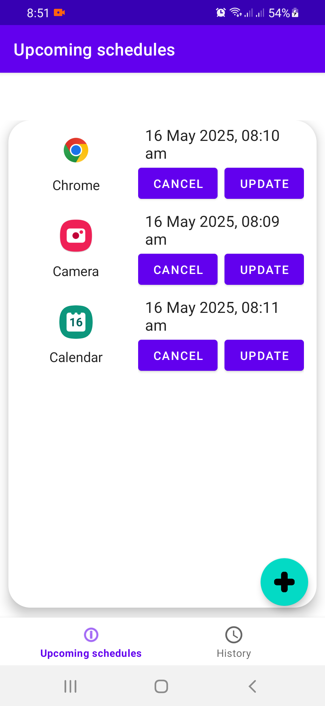
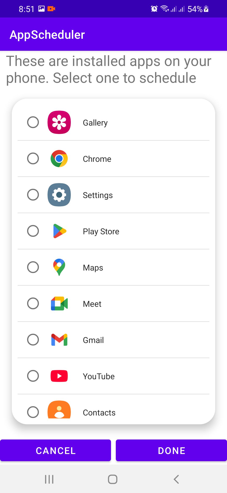
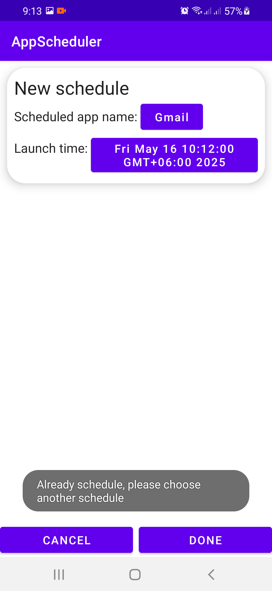
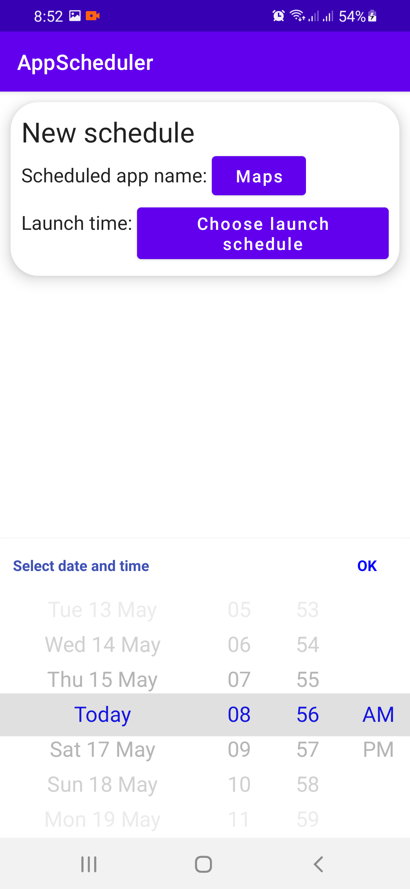

# App Schedule Coding Challenge

Requirement:
- The user can schedule any Android app which is installed on the device to start at aspecific time.
- The user can cancel the schedule if the scheduled app has not started.
- The user can change the time schedule of an existing scheduled app.
- It should support multiple schedules without time conflicts.
- The schedule record must be kept to query if the schedule was successfully executed.

<h2>📸 App Screenshots</h2>

  
  
  
  

## ✅ Features Implemented
- Add new schedule to launch at specific time
- View schedule list
- Cancel existing schedule
- Modify an already existing schedules

## ⏳ Features Not Implemented/Limitation
- Scheduled app will launch only if the AppSchedule app is in foreground. There are limitation in Android newer versions
to launch app from background. It is no longer possible without explicit user communication. In that case, an alternate approach
that might have been added is- a notification to show in status bar, when the launch schedule is received in broadcast receiver. After user permits from 
notification tray, scheduled app can launch. But it requires more permission and manual user interaction.

- Query or show the list of successful launch of scheduled app. As fer Android provided guidelines, there is system limitation
in getting the list of other app launch information. It is more restricted when app is background. One workaround could be using
UsageStateManager class to query the successul app launch history in recent times. But there is limitation here as well. When
app has not started within the threshold but started after that period, this would give user wrong stats.

## 📽️ App Video
[Video Demo](https://drive.google.com/file/d/1tm5bHzvNWNumlcQKf9Mw7nzKWEmd2DAn/view?usp=sharing)

## 📱 APK File
[Apk link](https://drive.google.com/file/d/14tbPCTUpQXIYkm8qXvvaeB9JIW76k48t/view?usp=sharing)

## 🧪 How to Test
1. Install APK on any Android 8+ device.
2. Add/Modify schedule using the "+" button.
3. View scheduled list in homescreen tab.

## 🛠️ Tech Stack
- Kotlin, Android Jetpack, MVVM
- Coroutines, Room, LiveData, ViewModel
- Material Components
