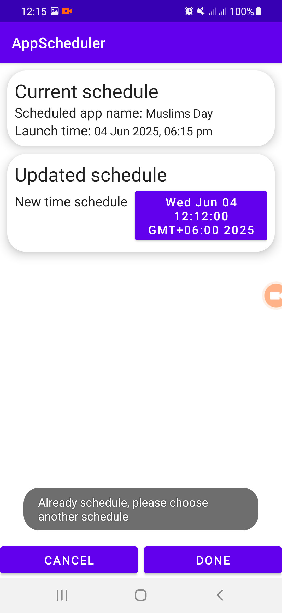

# App Schedule Coding Challenge

Requirement:
- The user can schedule any Android app which is installed on the device to start at a specific time.
- The user can cancel the schedule if the scheduled app has not started.
- The user can change the time schedule of an existing scheduled app.
- It should support multiple schedules without time conflicts.
- The schedule record must be kept to query if the schedule was successfully executed.

<h2>📸 App Screenshots</h2>

  
  
  
  
  
  
  
  

## ✅ Features
- User can schedule any Android app installed on phone to launch at specific future time,a notification will be shown to user at his scheduled time to give him the option to launch or not launch the app
- Show successful history of previously launched app
- Cancel schedule if the scheduled time is not yet arrived
- Modified time schedule of any existing installed app on phone
  
## 📽️ App Video
[Video Demo](https://drive.google.com/file/d/1O3Ir-8BTKbOPAj7h_6xhD3W_muyhxERB/view?usp=drive_link)

## 📱 APK File
[Apk link](https://drive.google.com/file/d/1UkEXdptBP3VlGsQsemB2BA8-NbUH3BRE/view?usp=drive_link)

## 🧪 How to Test
1. Install APK on any Android 8+ device.
2. Add/Modify schedule using the "+" button.
3. View scheduled list in upcoming schedule tab.
4. View scheduled history list in history tab.
   
## 🛠️ Tech Stack
- Kotlin, Android Jetpack, MVVM
- Coroutines, Room, LiveData, Flow, ViewModel
- Material Components
